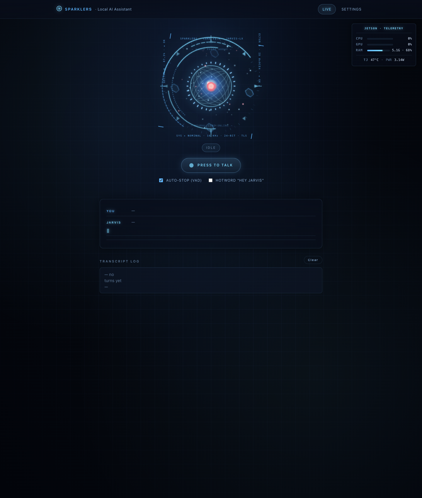
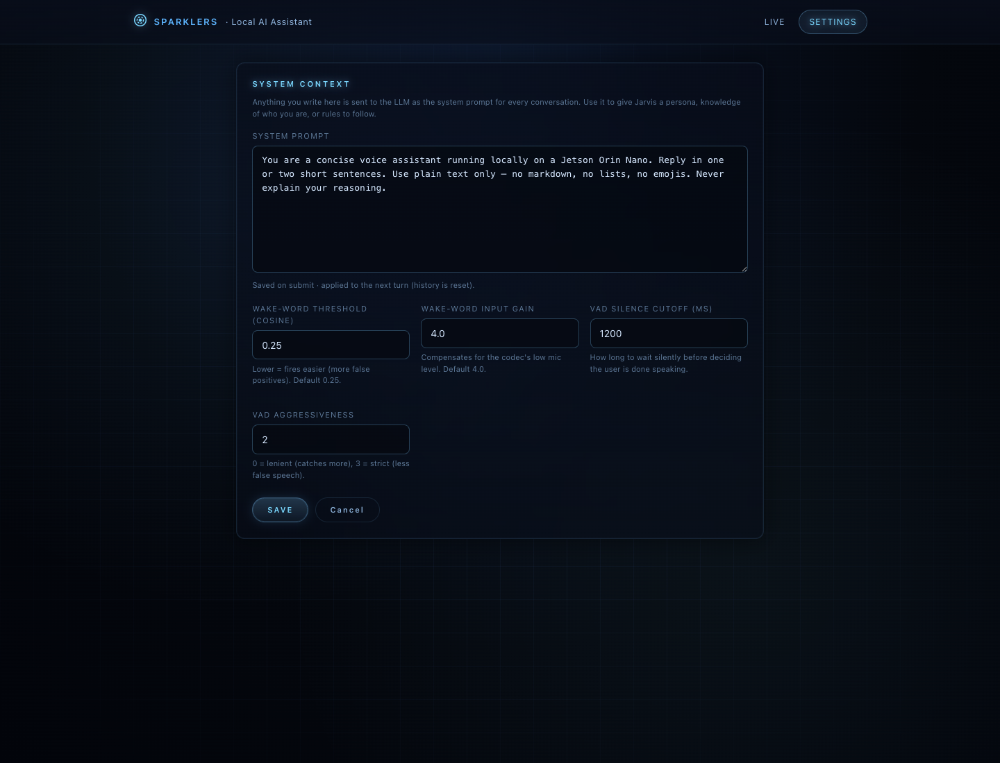

# Jetson Local AI Assistant · JARVIS

A fully offline voice assistant — wake word, speech-to-text, LLM, text-to-speech, all running on a single **NVIDIA Jetson Orin Nano Super** with a USB audio codec. No cloud, no API keys, no internet required after install.

The web UI is a futuristic JARVIS-style HUD with real-time amplitude-driven animations, live system telemetry from `tegrastats`, and a customisable system prompt.




The face animation reacts to the actual TTS audio amplitude (the bright burst, halo and spectrum bars all move in sync with what JARVIS is saying). System telemetry from `tegrastats` lives top-right — CPU/GPU utilization, RAM, junction temperature and live power draw.

---

## What's in the box

| Layer | Component | Where it runs |
|---|---|---|
| Wake word | [openWakeWord](https://github.com/dscripka/openWakeWord) (`hey_jarvis`) | CPU · TFLite |
| Speech-to-text | [faster-whisper](https://github.com/SYSTRAN/faster-whisper) (`small.en`, int8_float16) | GPU · CTranslate2 |
| Language model | [Qwen3-1.7B Q4](https://ollama.com/library/qwen3) via [Ollama](https://ollama.com/) | GPU |
| Text-to-speech | [Piper](https://github.com/rhasspy/piper) (en_GB-alan-medium · British male) | CPU · ONNX |
| End-of-speech VAD | [webrtcvad](https://github.com/wiseman/py-webrtcvad) | CPU |
| UI | Flask + SSE + vanilla JS/SVG | n/a |
| Telemetry | `tegrastats` | n/a |

Stats from a real session on the Jetson Orin Nano Super 8 GB (after warm-up):

| Step | Latency |
|---|---|
| Whisper transcribe (~3 s clip, beam=1, GPU int8/fp16) | **~600 ms** |
| Qwen3-1.7B first token (warm) | **~600 ms** |
| Piper synth (≈ 3 s audio, CPU) | **~300 ms in-process** |
| Wake → reply playback complete | **~5-7 s** end-to-end |

---

## Hardware

- **NVIDIA Jetson Orin Nano Super Developer Kit (8 GB)** — JetPack 6.2 (L4T R36.4.4), CUDA 12.6, cuDNN 9.3
- **USB audio codec** with a built-in mic (the build uses a [Waveshare USB audio codec](https://www.waveshare.com/usb-audio-codec.htm), but any USB sound card with PnP class-compliant audio works)
- Optional: HDMI display for the on-device UI; otherwise open `http://<jetson-ip>:8080/` from any machine on the LAN

> Other Jetsons (Orin NX, AGX Orin) should also work; only `sm_87`-specific code is the CTranslate2 build, which is delegated to the [Jetson AI Lab](https://pypi.jetson-ai-lab.io/) wheel and is built for sm_87 + sm_72/86/89.

---

## Quick start · Docker (recommended)

> Tested on JetPack 6.2 with Docker 29.5 + the `nvidia` container runtime + Ollama running on the host.

```bash
# 1) Prerequisites on the Jetson host
sudo apt-get install -y docker.io docker-compose-v2 nvidia-container-toolkit
sudo systemctl restart docker
# Ollama (LLM) runs on the host, the container talks to it on 127.0.0.1
curl -fsSL https://ollama.com/install.sh | sh
ollama pull qwen3:1.7b

# 2) Clone + build + run
git clone https://github.com/Arijit1080/jetson-local-ai-assistant-jarvis.git
cd jetson-local-ai-assistant-jarvis
mkdir -p models data
docker compose up -d --build

# 3) Open the UI
xdg-open http://localhost:8080/    # or just browse from any LAN device
```

First run pulls the L4T JetPack base image (~7 GB) and downloads the Piper voice (~61 MB). Subsequent starts are fast (<10 s).

**About the build time:** the base image is ~7 GB and pulling it can take 10-30 minutes depending on your network. The image build itself adds another 5-10 minutes. Plan accordingly.

**Verifying:** `docker compose logs -f jarvis` — wait for `serving at http://0.0.0.0:8080/`.

### What the compose file does

- `runtime: nvidia` — gives the container CUDA + cuDNN.
- `network_mode: host` — the container reaches the host's Ollama at `127.0.0.1:11434` and binds the UI on `:8080`.
- `devices: /dev/snd` + `group_add: "29"` — passes the USB audio codec through and joins the host's `audio` group.
- `volumes: ./models` + `./data` — persists models + your custom system prompt across rebuilds.

---

## Quick start · From scratch (no Docker)

The fully-manual path. Every step explicit — if Docker doesn't work on your Jetson for any reason, this is the path to use.

### 0. Verify your hardware

```bash
# Confirm you're on a Jetson Orin with JetPack 6.x
cat /proc/device-tree/model       # → "NVIDIA Jetson Orin Nano …"
cat /etc/nv_tegra_release | head -1   # → R36 (release), REVISION: 4.x
nvcc --version                    # → CUDA 12.6
dpkg -l | grep cudnn              # → libcudnn9-cuda-12 9.3.x

# Confirm the USB audio codec is detected
lsusb | grep -i audio             # any USB PnP audio device works
arecord -l                        # should list a capture device
aplay -l                          # should list a playback device
```

### 1. System packages

```bash
sudo apt-get update
sudo apt-get install -y \
    python3-pip python3-venv python3-dev \
    portaudio19-dev libsndfile1 ffmpeg \
    cmake ninja-build build-essential curl
```

### 2. Ollama + Qwen3-1.7B

```bash
curl -fsSL https://ollama.com/install.sh | sh   # ~150 MB
ollama pull qwen3:1.7b                          # ~1.4 GB
# Verify GPU placement:
ollama ps                                       # PROCESSOR column should show 100% GPU
```

### 3. Clone + Python venv + dependencies

```bash
git clone https://github.com/Arijit1080/jetson-local-ai-assistant-jarvis.git
cd jetson-local-ai-assistant-jarvis
python3 -m venv venv && source venv/bin/activate
pip install --upgrade pip wheel

# numpy must stay <2 — tflite-runtime 2.14 used by openWakeWord still requires it
pip install 'numpy<2'

# Jetson-specific wheels (CUDA-enabled) — fetched from NVIDIA's Jetson AI Lab
pip install \
    --extra-index-url https://pypi.jetson-ai-lab.io/jp6/cu126 \
    onnxruntime-gpu ctranslate2

# faster-whisper with --no-deps so it doesn't pull the CPU ctranslate2 from PyPI
pip install --no-deps faster-whisper==1.2.1

# Everything else
pip install -r requirements.txt
pip install huggingface-hub tokenizers av tqdm cffi
```

> **Why the special handling for `ctranslate2`?** PyPI's aarch64 wheel is CPU-only — it would shadow any GPU build. The [Jetson AI Lab](https://pypi.jetson-ai-lab.io/) hosts a CUDA build matching JetPack 6.2. If that wheel ever disappears, fall back to [building CTranslate2 from source](#fallback-build-ctranslate2-from-source).

### 4. Download the Piper voice

```bash
./scripts/download-models.sh
```

(Downloads `en_GB-alan-medium` — 61 MB. Other models — Whisper `small.en` ~244 MB, openWakeWord ~50 MB, Silero VAD ONNX ~1.8 MB — are downloaded automatically on first use.)

### 5. Run

```bash
python chatbot_server.py --port 8080
```

First start takes ~30 s as it loads Whisper + Piper + Ollama warmup. Look for:

```
[init] ready in 32.0s
serving at http://0.0.0.0:8080/
```

Then open `http://<jetson-ip>:8080/` from any browser on the LAN.

### 6. First conversation

1. Click **Press to Talk** (or hit space).
2. Speak. The button turns red while recording — VAD will auto-stop ~1.2 s after you finish, or click again to stop early.
3. Watch the transcript appear (STT), then JARVIS's reply stream in token-by-token (LLM), then hear it back (TTS).

To use the wake word: toggle **Hotword "Hey Jarvis"** and just say *"Hey Jarvis, what's the weather like on Mars?"* — beep → recording → reply.

---

### Fallback: build CTranslate2 from source

If `pip install ctranslate2 --extra-index-url https://pypi.jetson-ai-lab.io/jp6/cu126` fails (e.g. the lab took the wheel down), build CT2 yourself:

```bash
# Sources need: cuDNN dev headers + cmake + ninja
git clone --recursive https://github.com/OpenNMT/CTranslate2.git
cd CTranslate2
mkdir build && cd build
cmake .. -G Ninja \
  -DWITH_CUDA=ON -DWITH_CUDNN=ON \
  -DCMAKE_BUILD_TYPE=Release \
  -DCMAKE_CUDA_ARCHITECTURES=87 \
  -DWITH_MKL=OFF -DOPENMP_RUNTIME=COMP
ninja -j3                    # -j3 keeps RAM use under 8 GB
sudo ninja install && sudo ldconfig

# Then the Python binding, against the libctranslate2.so we just installed
cd ../python
pip install -r install_requirements.txt
pip install .
```

Takes ~5 min on the Orin Nano. `sm_87` is the right CUDA arch for the Orin Ampere.

---

## Using it

| Mode | How |
|---|---|
| **Push-to-talk** | Click the mic button, speak, click again to stop. |
| **Auto-stop** | Toggle "Auto-stop (VAD)" — recording ends ~1.2 s after you finish talking. |
| **Hotword** | Toggle "Hotword (Hey Jarvis)" — say "Hey Jarvis" + your question. |
| **Custom persona** | `/settings` → edit the system prompt. Saved across restarts. |

The web UI streams the transcript and Jarvis's reply token-by-token via Server-Sent Events. The face's spectrum bars, halo, and core react to the actual TTS audio amplitude. Live CPU / GPU / RAM / temperature / power numbers from `tegrastats` are docked top-right.

---

## Architecture

```
                          ┌──────────────────────────────────────┐
                          │            Web UI (Flask + SSE)      │
                          │    HUD · spectrum · live transcript  │
                          └─────────────────────┬────────────────┘
                                                │ /events
                                                ▼
  ┌──────────┐   wake   ┌────────────┐   audio   ┌──────────────┐
  │ Mic (USB)│──────▶  │ openWake-  │ ─────────▶│ WebRTC VAD   │
  │  codec   │         │ Word loop  │           │  end-of-     │
  └──────────┘         │ ("hey_jarvis")          │  speech      │
                        └────────────┘           └─────┬────────┘
                                                       │ wav (16 k mono)
                                                       ▼
                                            ┌──────────────────┐
                                            │ faster-whisper   │
                                            │  small.en (GPU)  │
                                            └────────┬─────────┘
                                                     │ text
                                                     ▼
                                            ┌──────────────────┐
                                            │ Ollama / Qwen3   │
                                            │  1.7B Q4 (GPU)   │
                                            └────────┬─────────┘
                                                     │ token stream
                                                     ▼
                                            ┌──────────────────┐
                                            │ Piper TTS (CPU)  │
                                            │  en_GB-alan      │
                                            └────────┬─────────┘
                                                     │ wav
                                                     ▼
                                            ┌──────────────────┐
                                            │ Speaker (codec)  │
                                            └──────────────────┘
```

Token-stream → TTS is interleaved: the LLM produces tokens, the speaker buffers until a sentence boundary, synthesises it, and plays it while the LLM keeps generating. The browser receives the same tokens via SSE and renders them character-by-character with a blinking cursor.

---

## Customisation

| Setting | Where | Effect |
|---|---|---|
| System prompt | `/settings` page or `data/settings.json` | LLM persona / rules |
| Match threshold | `/settings` · `WAKE_THRESHOLD` | Wake-word sensitivity |
| Wake-word input gain | `/settings` · `WAKE_INPUT_GAIN` | Boost low-level codec mic before oWW |
| Silence cutoff (ms) | `/settings` · `SILENCE_MS` | How long of silence ends a turn (VAD mode) |
| Piper voice | `config.py` · `PIPER_VOICE` | Swap in any [Piper voice](https://huggingface.co/rhasspy/piper-voices) |
| LLM model | `config.py` · `OLLAMA_MODEL` | Any model pulled via `ollama pull` |
| Whisper model | `config.py` · `WHISPER_MODEL` | `tiny.en` / `base.en` / `small.en` / `medium.en` |

### Settings page



System prompt is persisted to `data/settings.json` (Docker) or `settings.json` (manual). Edits apply on the next conversation turn; conversation history is reset to keep the new persona consistent.

---

## Testing each component independently

Useful for debugging if something doesn't work end-to-end. All commands assume your venv is activated.

```bash
# Whisper alone (transcribe a known WAV)
python -c "
from faster_whisper import WhisperModel
m = WhisperModel('small.en', device='cuda', compute_type='int8_float16')
segs, _ = m.transcribe('test.wav', beam_size=1)
print(' '.join(s.text for s in segs))
"

# Piper alone (synthesize to a WAV)
echo 'System nominal.' | python -m piper \
    --model models/piper/en_GB-alan-medium.onnx \
    --output_file /tmp/jarvis_test.wav
aplay /tmp/jarvis_test.wav

# Ollama alone (one-shot generation)
ollama run qwen3:1.7b --think=false 'In one sentence, what is the Jetson Orin Nano?'

# Codec mic level check
python -c "
import sounddevice as sd, numpy as np
audio = sd.rec(int(3 * 16000), samplerate=16000, channels=1, dtype='int16',
               device='USB PnP Audio Device')
sd.wait()
import math
print('RMS:', int(math.sqrt(np.mean(audio.astype(float)**2))),
      'peak:', int(np.abs(audio).max()), '/ 32767')
"
```

---

## Troubleshooting

- **`CUDA out of memory` when starting** — Ollama is still holding the previous model. Run:
  ```bash
  ollama stop qwen3:1.7b
  sudo sync && sudo sh -c "echo 3 > /proc/sys/vm/drop_caches"
  ```
- **No audio device found** — confirm the codec appears in `arecord -l` and `aplay -l`, then make sure the container has `--device /dev/snd` + `--group-add 29` (or your host's `audio` GID).
- **Hotword misses my "Hey Jarvis"** — boost `WAKE_INPUT_GAIN` (Settings) and/or lower `WAKE_THRESHOLD`. AGC codecs run very quiet at the mic; default gain is 4× (≈ 12 dB).
- **Silero VAD reports 0 on real speech** — known issue with heavily AGC'd codecs. The build ships with WebRTC VAD as the auto-stop engine instead; Silero is kept around in `vad.py` for projects on cleaner mics.
- **`onnxruntime-gpu` or `ctranslate2` fails to install** from the Jetson AI Lab index — confirm you're on JetPack 6.x (`cat /etc/nv_tegra_release`) and your Python is 3.10 (the index serves `jp6/cu126` for Python 3.10). For other JetPack versions, browse [pypi.jetson-ai-lab.io](https://pypi.jetson-ai-lab.io/) for the matching index path.
- **Docker container can't see the mic** — confirm host has `/dev/snd/` populated (`ls -la /dev/snd/`), confirm container has `--device /dev/snd` and is in the `audio` group (GID 29 on JetPack 6.2; `getent group audio` to check yours).
- **Docker container can't reach Ollama** — `network_mode: host` is essential. If you can't use host networking, set `OLLAMA_URL=http://host.docker.internal:11434` and add `extra_hosts: ["host.docker.internal:host-gateway"]` to the compose service.
- **Disk full while building Docker image** — the L4T base image is ~7-9 GB. Free space with `docker system prune -af` (removes unused images/build cache).

---

## Repo layout

```
.
├── chatbot_server.py        # Flask + SSE web server, main entry point
├── config.py                # All tunables
├── llm.py                   # Ollama HTTP client (token streaming)
├── stt.py                   # faster-whisper wrapper
├── tts.py                   # Piper Speaker (with envelope callback for lip-sync)
├── vad.py                   # Silero VAD (legacy, kept for cleaner mics)
├── wake.py                  # standalone openWakeWord listener (assistant.py)
├── record.py                # WebRTC-VAD-based recorder
├── system_stats.py          # tegrastats parser for the telemetry HUD
├── assistant.py             # CLI version (no UI, no SSE)
├── record_samples.py        # Capture user "Hey Jarvis" samples (future custom training)
├── test_pipeline.py         # Mic-free smoke test (file → STT → LLM → TTS)
├── templates/
│   ├── chat.html            # Main HUD page (animated face + SSE consumer)
│   └── settings.html        # System prompt + tunables editor
├── static/style.css         # Futuristic dark theme + animations
├── scripts/
│   ├── download-models.sh   # Pulls Piper voice
│   └── docker-entrypoint.sh
├── Dockerfile               # NVIDIA L4T JetPack 6.2 based
├── docker-compose.yml       # nvidia runtime + host network + audio passthrough
├── requirements.txt
├── DEVLOG.md                # Build log (full tutorial-style narration)
└── docs/                    # Screenshots
```

---

## License

MIT. See [LICENSE](LICENSE).

## Credits

Built with great open-source: [Ollama](https://ollama.com/), [Qwen3](https://qwenlm.github.io/), [faster-whisper](https://github.com/SYSTRAN/faster-whisper) / [CTranslate2](https://github.com/OpenNMT/CTranslate2), [openWakeWord](https://github.com/dscripka/openWakeWord), [Piper](https://github.com/rhasspy/piper), [webrtcvad](https://github.com/wiseman/py-webrtcvad), [silero-vad](https://github.com/snakers4/silero-vad), and [NVIDIA Jetson AI Lab](https://www.jetson-ai-lab.com/).

Demo voice trained on Alan from [rhasspy/piper-voices](https://huggingface.co/rhasspy/piper-voices).
